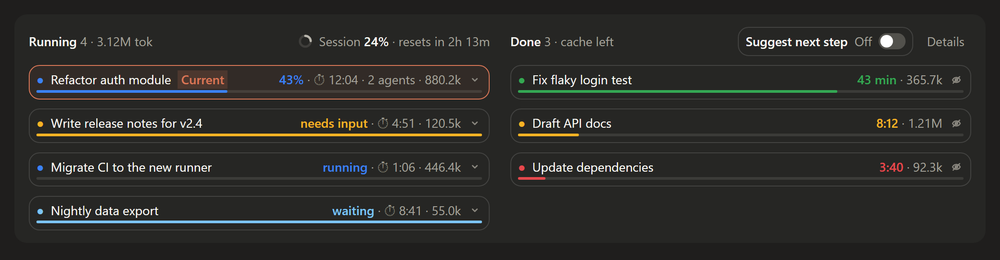
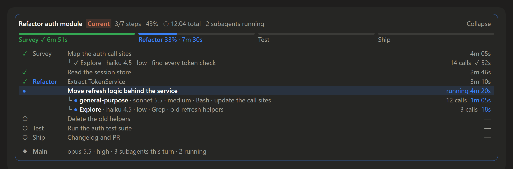

# task-board

A board above the prompt in the Claude desktop app's **Code** tab (macOS) that shows every Claude Code session you have going, side by side: what is running, what is waiting for you, what has finished, and how much prompt cache each finished session has left.

This is the macOS port of [Claude-WINdesktop-task-board](https://github.com/unopot/Claude-WINdesktop-task-board): same board, same details panel, same settings; only the background scanner and the file paths changed.



Expand a running card to see its task list by stage, how long each step took, which model the session runs on, and which subagents each step sent out:



## What it shows

**Running** (left column), one card per live session:

| Color | Status | Meaning |
| --- | --- | --- |
| blue | `43%` / `running` | working; the percentage is the task list's progress |
| yellow | `needs input` | waiting for you: a permission dialog, a question, or an MCP form |
| light blue | `waiting` | stopped on a long tool call that does not need you |

Each card also shows the elapsed time, how many subagents are running and the tokens used. The ring at the top right is your account's five-hour usage limit (the *Current session* figure on the Usage page), with the time until it resets.

**Done** (right column): finished sessions with a countdown of their prompt cache. When the cache expires, the next message rewrites the whole context, so this tells you which conversations are still cheap to continue. The session you are in gets a toast a few minutes before its cache runs out.

Interactions:

- Click a card to switch to that session.
- The arrow on a running card opens its details above the board: a stage strip, one row per step with its time, subagents under the step that started them (type, model, effort, current tool, task, tool calls, time), and a **Main** row with the session's own model and effort ("no subagents this turn" when there are none).
- The eye icon on a finished card hides it; it comes back by itself when that session gets a new request. **Details** (or `/task-board`) opens a pane listing every recent session, hidden ones included, with **Unhide**.
- **Next step** (on until you switch it off; one switch for all sessions): after each answer, fork the session once to propose three next prompts; clicking one fills the prompt box and never sends it. It costs one extra request per turn, so switch it off on the board if you do not want that.

## See sessions from your other computers

If you also run Claude Code on a Windows PC, the board can show that computer's sessions too, and the Windows PC board can show this one's. Install the Windows PC version ([Claude-WINdesktop-task-board](https://github.com/unopot/Claude-WINdesktop-task-board)) there; both plugins then share one folder in a synced drive.

By default that folder is **`~/Library/Mobile Documents/com~apple~CloudDocs/Claude Code/task-board-shared`** (iCloud Drive). Each computer writes its own snapshot there every 10 seconds and reads the others'. Cards from another computer carry a grey **Win** or **Mac** tag in front of the title, and the Details pane says which computer they are on.

What to expect:

- Remote cards are **read-only**: clicking one cannot switch to a session on another machine. Expanding a running card's details works as usual.
- **Hide** and the **Next step** switch stay per computer.
- Delay = the 10-second snapshot cycle plus the drive's sync time: iCloud Drive usually a few seconds to a minute, OneDrive similar, Syncthing a second or two on a LAN.
- A computer whose snapshot is more than 10 minutes old is treated as offline and disappears from the board.
- To use OneDrive, Syncthing or another folder, change the **Shared folder** setting on both computers to the same place (`~` means your home folder). Clear it to turn sharing off.
- Nothing leaves your computers except through the synced drive you chose: the snapshot is the same data the board shows (session titles, progress, token counts), nothing from the conversations themselves.

## Requirements

- **macOS.** The background scanner is a Perl script run by `/usr/bin/perl` (5.34 with `JSON::PP`), which every Mac ships with. Nothing to install.
- **The Claude desktop app, Code tab.** The board is drawn for the desktop. In a terminal session it shows a compact one-line summary instead.
- A Claude Code build that loads hooks-module plugins ("mods"). Developed and tested on Claude Code 2.1.289.
- The usage ring needs a Claude subscription; without one it stays hidden.

## Install

```bash
claude plugin marketplace add unopot/Claude-MACdesktop-task-board
```

```bash
claude plugin install task-board@unopot-mac-mods
```

Then quit the Claude desktop app completely (⌘Q, including the menu bar icon) and open it again. The board appears above the prompt a few seconds after your first message.

Update later with:

```bash
claude plugin marketplace update unopot-mac-mods
```

```bash
claude plugin update task-board@unopot-mac-mods
```

## Optional: group steps into stages

The board reads the task list Claude keeps for multi-step work. To get the stage strip, turn on the task tools and ask Claude to prefix task titles with a stage name:

1. In `~/.claude/settings.json`:

   ```json
   { "env": { "CLAUDE_CODE_ENABLE_TODO_TOOLS": "1" } }
   ```

2. In `~/.claude/CLAUDE.md`:

   ```markdown
   For tasks with three or more steps, create a task list with TaskCreate. Title each task
   `Stage: step` (short stage names, e.g. `Survey: Read files`) and create a stage's steps
   together. Mark a step in_progress when you start it and completed as soon as it is done.
   ```

Without these the board still works; the details simply list the steps without stages.

## Settings

Run `/plugin configure task-board@unopot-mac-mods` in Claude Code:

| Setting | Default | |
| --- | --- | --- |
| Prompt cache lifetime | 60 min | 60 on a subscription; usually 5 on pay-as-you-go API |
| Warn before cache expires | 5 min | 0 turns the toast off |
| Skip suggestions after short answers | 80 characters | no suggestion, and no extra request, after shorter answers |
| Let suggestions use skills and slash commands | on | a suggestion may be `/skill-name` |
| Shared folder for other computers | `~/Library/Mobile Documents/com~apple~CloudDocs/Claude Code/task-board-shared` | a folder in a synced drive; empty = this computer only |
| This computer's name in the shared folder | the host name | the file name used in the shared folder |

## How it works and what it touches

- Each session starts one small Perl process (`scan.pl`) that reads the transcripts under `~/.claude/projects` incrementally every 3 seconds, plus the desktop app's session list under `~/Library/Application Support/Claude/claude-code-sessions` for titles and links. Nothing leaves your machine; the plugin makes no network requests of its own.
- A session marks itself as *needs input* when it raises a permission dialog, `AskUserQuestion` or an MCP form, and clears the mark when the call finishes or the turn ends.
- It writes four small things under `~/.claude`: `task-board-prefs.json` (switch and hidden sessions), `task-board-usage.json` (latest usage reading, shared between sessions), `task-board-snapshot.json` (the latest scan, so a new session shows the board at once) and the folder `task-board-input/` (the needs-input marks). With sharing on it also writes `<computer name>.json` into the shared folder. Delete them after uninstalling if you like.
- Clicking a card runs `open claude://…`, which brings the desktop app to that session.

## Known limitations

- macOS only. For Windows use [Claude-WINdesktop-task-board](https://github.com/unopot/Claude-WINdesktop-task-board). Both can share one board (see above).
- Cards from another computer cannot be clicked to switch to that session.
- The plugin cannot see the moment you approve a permission dialog, so after you approve a long command the card stays yellow until that command finishes.
- A subagent is attached to the step that was in progress when it started; subagents started between steps are listed under **Main**.

## Uninstall

```bash
claude plugin uninstall task-board@unopot-mac-mods
```

```bash
claude plugin marketplace remove unopot-mac-mods
```

## Development

The plugin lives in [`task-board/`](task-board); the repository root is its marketplace.

```bash
claude plugin validate task-board
```

```bash
claude plugin test task-board
```

The scanner has its own tests against synthetic transcripts:

```bash
perl task-board/tests/scan.t
```

To watch what the scanner reports for your real sessions:

```bash
perl task-board/scan.pl --once
```

## License

[MIT](LICENSE) © 2026 unopot
